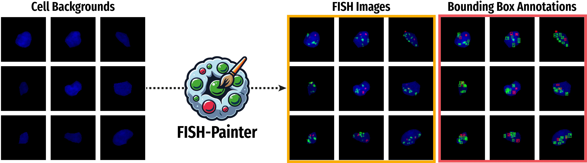

# FISHPainter



## Overview

FISHPainter is a Python library designed for image processing and generation, specifically tailored for FISH (Fluorescence In Situ Hybridization) images. The library offers a wide range of functionalities, from preprocessing TIFF images, merging bounding boxes based on overlap criteria, to providing an end-to-end workflow for generating a synthetic dataset based on user-defined criteria. It includes a library of DAPI-stained images of fluorescence microscopy nuclei [[1]](https://zenodo.org/records/10798938).

*FISHPainter as of now only supports the creation of FISH probes used for the assessment of copy number, but future functionality is planned for ALT and Break-Apart probes.*

## Features

- **Create Synthetic Dataset**: This feature enables the creation of a synthetic dataset using either a user-defined library for cell backgrounds or the provided library. See [create.py](https://github.com/SimonBon/FISHPainter/blob/main/FISHPainter/src/datasets/preprocess.py) for details. An overview of its usage is provided in the [Notebook](https://github.com/SimonBon/FISHPainter/blob/main/notebook.ipynb).
- **Preprocessing**: Functions for reading TIFF images and normalizing them are available at [preprocess.py](https://github.com/SimonBon/FISHPainter/blob/main/FISHPainter/src/preprocess.py).
- **Bounding Boxes**: Functions to decide if two bounding boxes should be merged and to merge bounding boxes for a given label can be found at [process_boxes.py](https://github.com/SimonBon/FISH-Painter/blob/main/FISHPainter/src/process_boxes.py).
- **Signal Generation**: Functions for creating FISH images and their signal creation procedure can be found in [signals.py](https://github.com/SimonBon/FISHPainter/blob/main/FISHPainter/src/signals.py).

## Installation

To install the library, you can use pip or clone the repository and install the required packages.

```bash
pip install FISHPainter
```
or

```bash
git clone https://github.com/SimonBon/FISHPainter.git
cd FISHPainter
pip install -r requirements.txt
```

## Creation of Synthetic Dataset

The first and most important step is to define a configuration file that specifies the different appearance types of FISH images you wish to create. The configuration file can omit any parameters (num_red, num_red_cluster, red_cluster_size, num_green, num_green_cluster, green_cluster_size) which will default to 0. These parameters can be specified as either a list of two entries (defining the low and high value from which FISHPainter will randomly choose for the creation of individual instances) or as an integer. The `number` parameter is essential to define how many instances of this condition you want to create. The `target_class` parameter is used when creating a h5 file to assign each patch a class, which might be used to train classification models.

```YAML
#definition of each condition and its parameters individually
CONDITION_0:                # Name is variable
  number: 100               # integer

  target_class: 0           # integer
#red definition
  num_red: [2, 3]           # [low, high] or number
  num_red_cluster: [1, 2]   # [low, high] or number
  red_cluster_size: [5, 10] # [low, high] or number

#green definition
  num_green: 2              # [low, high] or number
  num_green_cluster: 1      # [low, high] or number
  green_cluster_size: 6     # [low, high] or number
  
  signal_size: [1, 2]       # [low, high] or number


#definition of second condition
CONDITION_1:                # Name is variable
  number: 100               # integer

  target_class: 1           # integer
#red definition
  num_red: 2                # [low, high] or number
  num_red_cluster: 0        # [low, high] or number
  red_cluster_size: 0       # [low, high] or number

#green definition
  num_green: [6, 10]        # [low, high] or number
  num_green_cluster: 0      # [low, high] or number
  green_cluster_size: 0     # [low, high] or number
  
#size definition
  signal_size: 1            # [low, high] or number
```

Using this config file, you can create the synthetic dataset using the following lines of code:

```python
from FISHPainter.src.datasets.create import create_dataset
from FISHPainter.src.utils.utils import save2h5

config_file = PATH_TO_YOUR_CONFIG
output_h5_file = PATH_TO_H5_OUTPUT

dataset = create_dataset(config_file, FISH_type="COPY_NUMBER", verbose=True)

save2h5(dataset, output_h5_file)
```

An example of this can be viewed in the provided [Notebook](https://github.com/SimonBon/FISHPainter/blob/main/notebook.ipynb).
