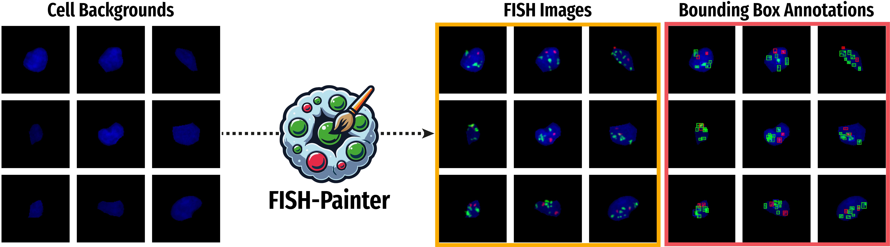

# FISHcreation



## Overview

FISHcreation is a Python library designed for image processing and analysis, specifically tailored for FISH (Fluorescence In Situ Hybridization) images. The library provides a range of functionalities, from preprocessing TIFF images to merging bounding boxes based on overlap criteria.

## Features

- **Preprocessing**: Functions for reading TIFF images and normalizing them. ([preprocess.py](https://github.com/SimonBon/FISHcreation/blob/main/FISHcreation/src/preprocess.py))
- **Bounding Boxes**: Functions to determine if two bounding boxes should be merged and to merge bounding boxes for a given label. ([process_boxes.py](https://github.com/SimonBon/FISHcreation/blob/main/FISHcreation/src/process_boxes.py))
- **Signal Generation**: Functions to create Gaussian signals and apply them to image patches. ([signals.py](https://github.com/SimonBon/FISHcreation/blob/main/FISHcreation/src/signals.py))
- **Utilities**: Functions to create datasets from bounding boxes. ([utils.py](https://github.com/SimonBon/FISHcreation/blob/main/FISHcreation/src/utils.py))

## Installation

To install the library, you can clone the repository and install the required packages.

```bash
git clone https://github.com/SimonBon/FISHcreation.git
cd FISHcreation
pip install -r requirements.txt
```

or 

```bash
pip install FISHcreation
```

## Preprocessing:

```python
from FISHcreation.src import preprocess
image = preprocess.get_cell_background("path/to/image.tiff", normalize=True)
```

## Create FISH images:

```python
fish_patch, boxes, labels = create_FISH(rgb_patch, mask_to_patch, num_red=2, num_green=8)
```